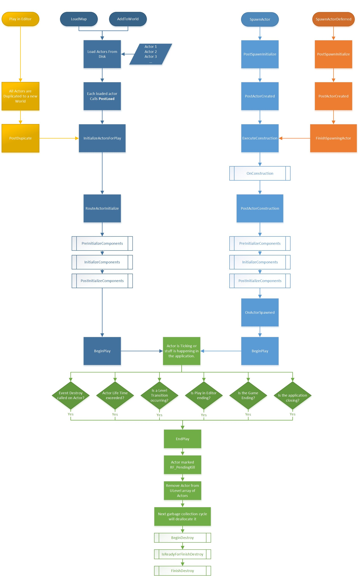

<details open markdown="block">
  <summary>
    Table of contents
  </summary>
  {: .text-delta }
1. TOC
{:toc}
</details>

## Ini file system

If there exist multiple ini files, and they happen to share a same key, then the new value will overwrite the old one.

In UE, there are many ini files and where store a lot of tuning parameter definitions, usually related to scalability.

The file hierarchy of these files are (sorted by load order), taking **Engine** config as example:

```text
* Engine/Config/Base.ini (usually empty)
* Engine/Config/BaseEngine.ini
* Engine/Config/<Platform>/<Platform>Engine.ini
* <ProjectDir>/Config/BaseEngine.ini
* <ProjectDir>/Config/<Platform>/<Platform>Engine.ini
* <ProjectDir>/Saved/Config/<Platform>/Engine.ini
```

## Main Menu & Settings

[Make A Professional MainMenu And A Settings Menu In Unreal Engine 5 (youtube.com)](https://www.youtube.com/watch?v=NOEM8mVk2r0)

## Modular Game Character

[My Workflow for Creating Modular Game Character for Unreal Engine (youtube.com)](https://www.youtube.com/watch?v=BIHvCA7BmbA)

## Light Baking

Simply speaking, the baking is **the editor just takes the textures of everything around the light, calculates the effect of the light on those textures (brightens them, perhaps colors them, shadows, etc.), and saves them as replacement textures to use**. It has some limitations, a light needs to be static for this to work (can't be moved it during gameplay) same for the objects which have interactions with the light.

In Unreal, the lightmaps (where the precomputed light information is stored) are embedded into the umaps (< UE4.14), after UE4.14, the light build data is stored in the **MapBuildDataRegistry** assets, separated from the umaps.

In Unreal4, the tool used to precompute the lighting, is called **Lightmass**, can be found in the world settings. What is [Lightmass]([Lighting Companion: Lightmass World Settings in UE4 – techarthub](https://www.techarthub.com/lighting-companion-lightmass-world-settings-in-ue4/)) ?

> Lightmass is an integrated part of Unreal Engine 4 which is responsible for **precomputed lighting.** This involves the generation of **lightmaps**, textures that are overlaid onto level geometry to give them the illusion of shadows, bounce lighting, and other natural lighting phenomena.
>
> Features that Lightmass supports include [global illumination](https://en.wikipedia.org/wiki/Global_illumination) (indirect/bounce lighting), ambient occlusion, volumetric lighting, and transmission (changes in color/intensity when light moves through semi-translucent objects).
>
> These features are all ***precomputed*** because they are generated *before* the game is run via a process called ***baking***. Depending on the quality and scale of the bake, this process can take a **long time.**
>
> All of these features are also collectively referred to as ***static lighting***, as they cannot be changed while the game is running. This is why you can’t move static lights during play. They are quite literally baked into the scene, and you’d need to rebake them to see any of your changes reflected in the world’s lightmaps. This is separate and distinct from ***dynamic lighting***, which *can* be altered at runtime. Lightmass does not handle dynamic lighting.

## Actor Lifecycle



Check more details at [Actor Lifecycle \| Unreal Engine Documentation](https://docs.unrealengine.com/4.26/en-US/ProgrammingAndScripting/ProgrammingWithCPP/UnrealArchitecture/Actors/ActorLifecycle/)

## DLSS Presets

[DLSS 3.7 - All Presets Compared - Star Wars Jedi Survivor - RTX 3070 - 1440p (youtube.com)](https://www.youtube.com/watch?v=DKveWcAGqHo)

