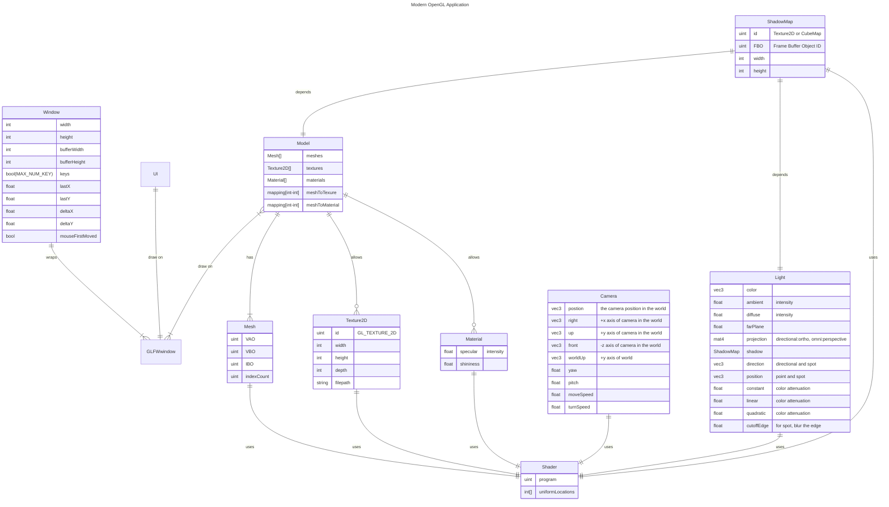

## Modern OpenGL

URL: https://github.com/IdioticProgramApe/ModernOpenGL.git

### Entity Relationship Diagram

```mermaid
---
title: Modern OpenGL Application
---
erDiagram
	Window ||--|{ GLFWwindow: wraps
	Window {
        int 						width
        int 						height
        int 						bufferWidth
        int 						bufferHeight
        
        bool(MAX_NUM_KEY) 			keys				
        
        float 						lastX				
        float	 					lastY				
        float	 					deltaX				
		float 						deltaY				
        bool 						mouseFirstMoved
	}
	
	UI ||--|| GLFWwindow: "draw on"
	UI {
		
	}
	
	Model }|--|{ GLFWwindow: "draw on"
	Model ||--|{ Mesh: has
	Model ||--o{ Texture2D: allows
	Model ||--o{ Material: allows
	Mesh ||--|| Shader: uses
	Texture2D ||--|| Shader: uses
	Material ||--|| Shader: uses
	Model {
		Mesh[] 						meshes
		Texture2D[] 				textures
		Material[] 					materials
		mapping[int-int] 			meshToTexure
		mapping[int-int] 			meshToMaterial
	}
	Mesh {
		uint						VAO					
		uint						VBO					
		uint						IBO					
		uint						indexCount
	}
	Texture2D {
		uint						id					"GL_TEXTURE_2D"
		
		int							width
		int							height
		int							depth				
		
		string						filepath
	}
	Material {
		float						specular			"intensity"
		float						shininess
	}
	
	Camera ||--|| Shader: uses
	Camera {
		vec3 						postion				"the camera position in the world"

        vec3 						right				"+x axis of camera in the world"
        vec3 						up					"+y axis of camera in the world"
        vec3 						front				"-z axis of camera in the world"
        vec3 						worldUp				"+y axis of world"

        float 						yaw					
        float 						pitch				
        
        float 						moveSpeed
        float 						turnSpeed
	}
	
	Light ||--|| Shader: uses
	ShadowMap ||--|| Shader: uses
	ShadowMap ||--|| Light: depends
	ShadowMap ||--|| Model: depends
	Light {
		vec3 						color

        float 						ambient				"intensity"
        float 						diffuse				"intensity"

		float						farPlane
        mat4 						projection			"directional:ortho, omni:perspective"
        ShadowMap 					shadow				
        
        vec3						direction			"directional and spot"
        
        vec3						position			"point and spot"
        float						constant			"color attenuation"
        float						linear				"color attenuation"
        float						quadratic			"color attenuation"
        
        float						cutoffEdge			"for spot, blur the edge"
	}
	
	Shader {
		uint						program
		int[]						uniformLocations	
	}
	
	ShadowMap {
		uint						id					"Texture2D or CubeMap"
		uint						FBO					"Frame Buffer Object ID"
		
		int							width
		int							height
	}
```

