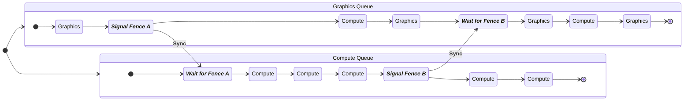

# New GPU Profiler & RHI Submission Pipeline

Ref: [New GPU Profiler and RHI Submission Pipeline \| Unreal Fest Stockholm 2025](https://www.youtube.com/watch?v=vnbARZHccpQ)

[TOC]

## GPU Queue

Can be regarded analogically as hyper-threads on CPU as queue on GPU.



Fences on GPU could be regarded analogically as locks on CPU

## GPU Profiler

We have 3 components in Unreal Engine:

- `stat GPU`
- `ProfileGPU` command
- Unreal Insights

They are heavily based on RHI breadcrumbs[^1], and sharing the unified data source

[^1]: TODO

### Stat GPU

Taking `BasePass` stat from stat GPU list:

```c++
// BasePassRendering.cpp
DEFINE_GPU_DRAWCALL_STAT(Basepass);

void FDeferredShadingSceneRenderer::RenderBasePassInternal(...)
{
    // ...
    if (bRenderLightmapDensity || ViewFamily.UseDebugViewPS()) { ... }
    else
    {
        SCOPE_CYCLE_COUNTER(STAT_BasePassDrawTime);
        RDG_EVENT_SCOPE_STAT(GraphBuilder, Basepass, "BasePass");
        RDG_GPU_STAT_SCOPE(GraphBuilder, Basepass);
        
        // ...
    }
    // ...
}
```

This gpu stat is defined in the code and linked to specific RDG event scopes and RHI breadcrumb scopes.

#### UE5.6

Stat GPU becomes Multi-GPU aware and Multi-Queue aware, aka, one stat page per GPU Queue.

Commands updated:

- `stat GPU[n]_[Queue][m]`: `stat GPU0_Graphics0`, `stat GPU0_Compute0`, `stat GPU0_Copy0`
- `stat gpu` (consider as a shortcut to toggle all of them on/off)

The stats get also expanded with extra counters:

- `Busy`: the same as `stat gpu` prior to UE5.6, time spent on doing useful work as running shaders
- `Wait`: new in UE5.6, track the time used for synchronization (fencing) inter-queues
  - generally, graphics queue should be kept busy, minimize the wait time on this queue
  - the fence latency can make queue idle for a short amount of time
- `Idle`: new in UE5.6, the time GPU is idling without doing any work
  - large number might indicate that the game is CPU bound

#### Concurrency

Queues are concurrent, don't sum the busy time up to get an total GPU time, use `stat unit` instead.

### ProfileGPU

This is for **single frame** GPU trace. 

`ProfileGPU` on a packaged build emits the results to log, it's also driven by RHI breadcrumbs which includes individual RDG pass names, and same as stat GPU, it's also muti-GPU / multi-Queue aware:

- better to disable async compute (`r.RDG.AsyncCompute 0`) if in a process of optimizing a particular render pass or a shader

A list of console variables for profile gpu:

| CVar                          | CVar                           |
| ----------------------------- | ------------------------------ |
| r.profilegpu.sort             | r.profilegpu.showemptyqueues   |
| r.profilegpu.root             | r.profilegpu.showstats         |
| r.profilegpu.thresholdpercent | r.profilegpu.showpercentcolumn |
| r.profilegpu.unicodeoutput    | r.profilegpu.showinclusive     |
| r.profilegpu.showleafevents   | r.profilegpu.showexclusive     |
| r.profilegpu.showheader       | r.profilegpu.showui            |

### Unreal Insights

Used to get a detailed GPU timing information

- GPU & CPU work on the same timeline, for a better context
- one row per GPU queue

Insights use the regions to highlight the queue status, whether they are working (region `GpuWork`), waiting (region `GpuWait`) or completely idling (no region at all).

Similar to TaskGraph in CPU tracks, on GPU, insights now has the Fence arrows to indicate the dependencies between GPU queues (RDG handles)

- check the fence number to verify the synchronization situation

#### RHI Submission Thread

A new thread lies in between RHI thread and driver, which prepares work for submission to:

- batches work to minimize driver / GPU overload
- resolves fences

There is a marker `RHI_SubmitToGPU` marker on RHI thread which will connect to RHI submission thread.

On RHI submission thread, the `F<GraphicsAPI>Queue::ExecuteCommandLists` will trigger the work on GPU graphics queue.

#### RHI Interrupt Thread

Another thread called RHI interrupt thread which:

- monitors for GPU work completion
- signals the rest of the engine
- handles all GPU queues

An example: 

1. GPU queue completes a work such as Occlusion Query work, it signals a fence
2. RHI interrupt thread catches that and re-signals to the TaskGraph (which marker `InterruptQueue_Process`/`SetEventOnCompletion`)
3. A worker gets woken up and continues the `OcclusionCullPipe` work.

## Renderer Pipeline

The RHI submission pipeline is shipped in UE5.5

### RHI API

#### High-Level Types

| Category     | Types                                                        |
| ------------ | ------------------------------------------------------------ |
| Command List | - `FRHICommandListBase`<br />  - `FRHIComputeCommandList`<br />  - `FRHICommandList`<br />  - `FRHICommandListImmediate` |
| Interfaces   | - `IRHIComputeContext` / `IRHICommandContext`<br />- `IRHIPlatformCommandList` |

RHI Contexts is used for translating the rendering commands into API-specific calls (Dx12, Metal, Vulkan...)

#### High-Level Overview

Renderer or RDG creates `FRHICommandList` instances, one per recording thread and they represent CPU timeline

One **RHICmdList** can have multiple RHI Contexts:

- `RHICmdList.SwitchPipeline(...);`
- `RHICmdList.EnqueueLambdaMultiPipe(...);`

All RHICmdLists submitted via `FRHICommandListImmediate` (an singleton owned by render thread):

- `ImmCmdList.QueueAsyncCommandListSubmit({...});`
- `ImmCmdList.ImmediateFlush(...);`

All RHICmdLists are recorded on render thread and translated on rhi thread (a replay of rhi commands, calling into the rhi context and generating the actual GPU commands).

#### Switching Pipelines

|         `IRHICommandContext`<br />(Graphics Context)         |                      `FRHICommandList`                       |      `IRHIComputeCommandContext`<br />(Compute Context)      |
| :----------------------------------------------------------: | :----------------------------------------------------------: | :----------------------------------------------------------: |
| `Draw(...);`<br />`Draw(...);`<br />`Draw(...);`<br />`Dispatch(...);` | `SwitchPipeline(ERHIPipeline::Graphics);`<br />`Draw(...);`<br />`Draw(...);`<br />`Draw(...);`<br />`Dispatch(...);` |                                                              |
|                                                              | `SwitchPipeline(ERHIPipeline::AsyncCompute);`<br />`Dispatch(...);`<br />`Dispatch(...);` |            `Dispatch(...);`<br />`Dispatch(...);`            |
|              `Dispatch(...);`<br />`Draw(...);`              | `SwitchPipeline(ERHIPipeline::Graphics);`<br />`Dispatch(...);`<br />`Draw(...);` |                                                              |
|                                                              | `SwitchPipeline(ERHIPipeline::AsyncCompute);`<br />`Dispatch(...);`<br />`Dispatch(...);`<br />`Dispatch(...);` | `Dispatch(...);`<br />`Dispatch(...);`<br />`Dispatch(...);` |

RHICmdList direct the proper context to translate the commands.

(TODO: 22:02)
