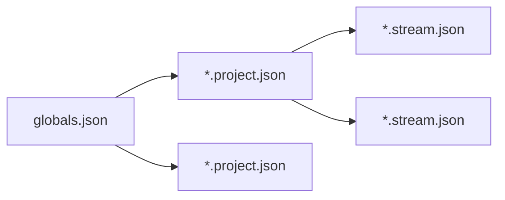

# Introduction to Horde: A Technical Primer

Ref: [Introduction to Horde: A Technical Primer \| Unreal Fest Stockholm 2025](https://www.youtube.com/watch?v=sZIOVNQfKxI)

[TOC]

## Overview

Horde is a CI/CD system focused on UE projects, automates manual parts for the software development pipeline. However it can also be:

- [ ] a remote device manager
- [ ] dashboards to display build health
- [ ] a build distribution coordinator
- [ ] an automated tester, integrated with Automation Tool and Gauntlet
- [ ] a manager to manage the telemetry data and show the overall editor performance of the team
- [ ] a UGS metadata server
- [ ] a toolbox where the team can download tools
- [ ] ...

## Configuration




| Category | Content                                                      |
| -------- | ------------------------------------------------------------ |
| Global   | - define what Projects to load<br />- define what Horde plugins to use<br />- define Perforce server addresses and information<br />- define UGS parameters (such as P4 address for UGS to point to)<br />- define display information for the Dashboard<br />- define Settings for Horde plugins<br />- define Storage settings<br />- define Access control list (ACL) |
| Project  | - define what Perforce streams to work with<br />- define what streams to show in the drop-down menu<br />- define what logo to show for this project |
| Stream   | - define category and jobs for CI/CD<br />- define artifact storage and retention |

We can also host the config files on Perforce (except for the streams jsons), however we will need to update the `server.json` with our Perforce credentials:


For streams configs, since the jobs are highly related to the projects, it's recommended to place them into the project streams, as:

```json
// *.project.json
{
    // ...
    "streams": [
        {
            "id": "cropout",
            "path": "//streams/CropOutProject/CropOut/Build/Horde/ue5-CropOut.stream.json"
        }
    ]
    // ...
}
```

> All the paths specified in the file is relative to the file we are writing in, applied to all json config files.

### JSON Schema

[Schema](https://json-schema.org/) is kind of a json data validator for editing the Horde config files, just add `http://horde-url/api/v1/schema/catalog.json` into the json schema in Virtual Studio:


To open the Json Schema: Visual Studio -> Tools -> Options -> Json -> Schema

### HordeAgent

HordeAgent as a service cannot open the editor or package builds for testing, good candidate for code compilation

whereas, HordeAgent as a standalone node triggered by Users can open unreal engine projects and packaged builds to run tests

which means, horde agents can be used to accelerate the compilation as Incredibuild and also are regarded as the test machines for the automated testing

### DevKit Devices

They are the non-desktop platforms as target device where we should run some automated tests.

There is a predefined device pool: `WIN-DEVKITAUTOMATION` (currently only for Windows, there might be a `MAC-DEVKITAUTOMATION`), all agents in this pool are responsible for pushing the content to the target devices, to add this pool in Horde server (globals.json):

```json
{
    "version": 2,
    
    "include": [
        {
            "path": "$(HordeDir)/Defaults/default.global.json"
        }
    ],
    
    "plugins": {
        "compute": {
            "pools": [
                {
                    "name": "WIN-DEVKITAUTOMATION",
                    "color": "Orange"
                }
            ]
        }
    }
}
```

after server hot-reloads this change, we can assign the agents we want to this pool.

## Auto-testing

| Plugin | Blueprint Functional Testing |
| ------ | ---------------------------- |
| Class  | `AFunctionalTest`            |

- can add tests with BP
- tests will be added to `project.` test path, which Horde will automatically pick them up and run them
- multi-platform support
- Horde provide automation hud to display the build health & build tests results to reflect the build stability

## Zen Server

Use zenserver as cooked output store, with this being setup we can effectively reduce the cooking time to expedite the pipeline iteration.

ref: [Base/Default]Game.ini

```ini
[/Script/UnrealEd.ProjectPackagingSettings]
bUseZenStore=true  ; make it to true
```

It will deploy a json file `ue.projectstore` to `<project>/Saved/Cooked/<platform>` directory

## UGS

ref: globals.json

```json
{
    "parameters": {
        "ugs": {
            "defaultPerforceServer": ...
        }
    }
}
```

## Studio Telemetry

| Plugin | Studio Telemetry |
| ------ | ---------------- |

This plugin is used to send analytics back to horde.

ref: BaseEngine.ini

```ini
; Studio Telemetry Settings
[StudioTelemetry.Config] 
SendTelemetry=true
SendUserData=false
SendHardwareData=true
SendOSData=true

; Example Log File Analytics
;[StudioTelemetry.Provider.Log] 
; Name=LogAnalytics
; ProviderModule=AnalyticsLog
; UsageType=Editor
; Override the default output location from Saved/Telemetry/Telemetry.json
; FileName="somefile.json"
; FolderPath="somefolder"

; Example Horde Analytics Settings
;[StudioTelemetry.Provider.Horde]
; Name=HordeAnalytics
; ProviderModule=AnalyticsET
; UsageType=EditorAndClient
; APIKeyET=HordeAnalytics.Dev
; APIServerET="https://myownhordeserver.com/" ; Point Server URL to your own Horde server
; APIEndpointET="api/v1/telemetry/engine"
```

ref: globals.json

```json
{
    "telemetryStores": [
        {
            "id": "engine",
            "include": [
                {
                    "path": "$(HordeDir)/Defaults/default-metrics.telemetry.json"
                },
                {
                	"path": "$(HordeDir)/Defaults/default-views.telemetry.json"
                }
            ]
        }
    ]
}
```

