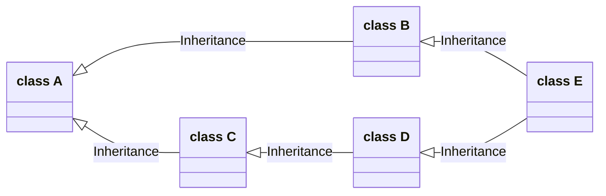

## `__new__`, `__init__` and `__call__`

| `__new__`                                                    | `__init__`                                                   | `__call__`                                                   |
| ------------------------------------------------------------ | ------------------------------------------------------------ | ------------------------------------------------------------ |
| - called first<br />- class method, which takes in `cls`<br />- populate `self` and return it<br />- takes same params as `__init__`<br />- inherited from `object` | - non-static method, which takes in `self`<br />- populate fields<br />- return nothing (`None`)<br />- inherited from `object` | - non-static method, which takes in `self`<br />- allows instances to be callable (functions)<br />- non-static method, which takes in `self`<br />- optional, not inherited from `object` |

## Type Function

```python
class person(object):
    def __init__(self, name, age):
        self.name = name
        self.age = age
    def __str__(self):
        return f"{self.name} is {self.age} yrs old"

a = person('a', 20)
print(a)  # output "a is 20 yrs old"
type(a)  # output <class '__main__.person'>
```

`type` can not only be used to inspect an object's type, but can also create a class:

```python
def __init__(self, name, age):
    self.name = name
    self.age = age
def __str__(self):
    return f"{self.name} is {self.age} yrs old"

alt_person = type(
    'alt_person',
    (object,),
    {
        '__init__': __init__,
        '__str__': __str__,
    }
)

b = alt_person('b', 30)
print(b)  # output "b is 30 yrs old"
type(b)  # output <class '__main__.alt_person'>
```

To create a class using `type`, we need to provide 3 things:

- the name of the class we want to make
- the base classes
- a dictionary contains all the attributes

By using `type`, we can dynamically create classes:

```python
class Person(object):
    def __init__(self, first, last):
        self.name = f"{first} {last}"
    
    def talk(self):
        print("I'm", self.name)
    
    @classmethod
    def make_family(cls, fam_name):
        def init(self, first, last = fam_name):
            cls.__init__(self, first, last)
        return type(
            fam_name,
            (cls,),
            {'__init__': init,}
        )
        
steve = Person('Steve', 'Jobs')
steve.talk()  # output "I'm Steve Jobs"

diable = Person.make_family('Diable')
me = diable("Sweet")
me.talk()  # output "I'm Sweet Diable"
print(type(me))  # output <class '__main__.Diable'>

print(isinstance(me, Person))  # output True
```

## Metaclass

`type` is not a function, it's a class

```python
print(type(1))                     # <class 'int'>
print(type(int))                   # <class 'type'>
print(type(type))                  # <class 'type'>
print(isinstance(type, type))      # True
print(type.__mro__)                # (<class 'type'>, <class 'object'>)
print(isinstance(type, object))    # True
print(isinstance(object, type))    # True
print(isinstance(object, object))  # True
print(isinstance(1, object))       # True
print(isinstance(1, type))         # False, since 1 is not a class
print(type(object))                # <class 'type'>
```

The type of a class is **metaclass** (which is a subclass of `type`):

```python
class MetaClass(type):
    def __new__(meta, name, bases, attrs):
        print(f"__new__({meta}, {name}, {bases}, {attrs})")
        return type.__new__(meta, name, bases, attrs)
    def __init__(cls, name, bases, attrs):
        print(f"__init__({cls}, {name}, {bases}, {attrs})")
        type.__init__(cls, name, bases, attrs)
    def __call__(cls, *args, **kwargs):
        print(f"__call__({cls}, {args}, {kwargs})")
        return type.__call__(cls, *args, **kwargs)
    
def init(self, name):
    self.name = name
def talk(self):
    print("I'm", self.name)
    
MetaPerson = MetaClass(
    'MetaPerson',
    (object,),
    {'__init__': init, 'talk': talk}
)

mp = MetaPerson("Sweet Diable")
mp.talk()  # output "I'm Sweet Diable"
```

The output of the `MetaPerson/mp` construction is:

```text
__new__(<class '__main__.MetaClass'>, MetaPerson, (<class 'object'>,), {'__init__': <function init at 0x000001B5CF50D3A0>, 'talk': <function talk at 0x000001B5CFD771F0>})
__init__(<class '__main__.MetaPerson'>, MetaPerson, (<class 'object'>,), {'__init__': <function init at 0x000001B5CF50D3A0>, 'talk': <function talk at 0x000001B5CFD771F0>})

__call__(<class '__main__.MetaPerson'>, ('Sweet Diable',), {})
```

If we convert `MetaPerson` into a normal class,

```python
class MetaPerson(metaclass=MetaClass):
    def __new__(cls, name):
        print(f"__new__({cls}, {name})")
        return super().__new__(cls)
    def __init__(self, name):
        print(f"__init__({self}, {name})")
        self.name = name
    def talk(self):
        print("I'm", self.name)
        
mp = MetaPerson("Sweet Diable")
```

the output will become:

```text
__new__(<class '__main__.MetaClass'>, MetaPerson, (), {'__module__': '__main__', '__qualname__': 'MetaPerson', '__new__': <function MetaPerson.__new__ at 0x000001F9156371F0>, '__init__': <function MetaPerson.__init__ at 0x000001F915637280>, 'talk': <function MetaPerson.talk at 0x000001F915637310>, '__classcell__': <cell at 0x000001F9152D9700: empty>})
__init__(<class '__main__.MetaPerson'>, MetaPerson, (), {'__module__': '__main__', '__qualname__': 'MetaPerson', '__new__': <function MetaPerson.__new__ at 0x000001F9156371F0>, '__init__': <function MetaPerson.__init__ at 0x000001F915637280>, 'talk': <function MetaPerson.talk at 0x000001F915637310>, '__classcell__': <cell at 0x000001F9152D9700: MetaClass object at 0x000001F9154FF780>})

__call__(<class '__main__.MetaPerson'>, ('Sweet Diable',), {})
__new__(<class '__main__.MetaPerson'>, Sweet Diable)
__init__(<__main__.MetaPerson object at 0x000001F9156332E0>, Sweet Diable)
```

From the output, we can see the class constructor in python actually has 3 parts(ordered): 

1. `__call__` method from class's metaclass
2. `__new__` method from class
3. `__init__`  method from class

They work together to [create a instance of class](https://blog.ionelmc.ro/2015/02/09/understanding-python-metaclasses/):

{: width="293" height="404" }

## Registering

To solve problems like:

- we want a class that knows about all of its subclasses (which is quite useful for APIs)

```python
class registrar(type):
    def _add_subclass(cls, c):
        cls.subclasses.append(c)
    def __init__(cls, name, bases, attrs):
        cls.subclasses = []
        for c in cls.mro()[1:]:
            if hasattr(c, "_add_subclass") and callable(c._add_subclass):
                c._add_subclass(cls)
```




```python
class A(metaclass=registrar): ...
class B(A): ...
class C(A): ...
class D(C): ...
class E(B, D): ...
```

The subclass list for each class is:

- `A.subclasses = [<class '__main__.B'>, <class '__main__.C'>, <class '__main__.D'>, <class '__main__.E'>]`
- `B.subclasses = [<class '__main__.E'>]`
- `C.subclasses = [<class '__main__.D'>, <class '__main__.E'>]`
- `D.subclasses = [<class '__main__.E'>]`
- `E.subclasses = []`

## Singletons

Singleton is a software design pattern that restricts the instantiation of a class to one object. In python, `True`, `False` and `None` are some example of Singletons. (can use `id` and `is` to check)

```python
class singleton(type):
    def __init__(cls, name, bases, attrs):
        cls._instance = None
    def __call__(cls, *args, **kwargs):
        if cls._instance is not None:
            return cls._instance
        cls._instance = super().__call__(*args, **kwargs)
        return cls._instance
```

```python
class Person(metaclass=singleton):
    def __init__(self, name):
        self.name = name
    def talk(self):
        print("I'm", self.name)
        
Person("a").talk()  # output "I'm a"
Person("b").talk()  # output "I'm a"
```

```python
class Student(Person):
    def __init__(self, name, student_id):
        self.id = student_id
        super().__init__(name)
    def report(self):
        print(self.id)
        
Student('c', 'abc123').report()  # output "abc123"
Student('d', 'def456').report()  # output "abc123"
```

Singleton can also be implemented by using **superclasses** or **decorators**.

## Compare and Contrast

| `super()`                                                    | `@decorator`                                                 | `metaclass=...`                                              |
| ------------------------------------------------------------ | ------------------------------------------------------------ | ------------------------------------------------------------ |
| - simplest<br />- code reuse<br />- can be overriden<br />- runs at runtime<br />- convenient mro | - closure<br />- aspect oriented<br />- runs at definition<br />- composable<br />- no inheritance<br />- works on functions | - complete control<br />- inherited<br />- runs at definition<br />- change what it means to be a class |

