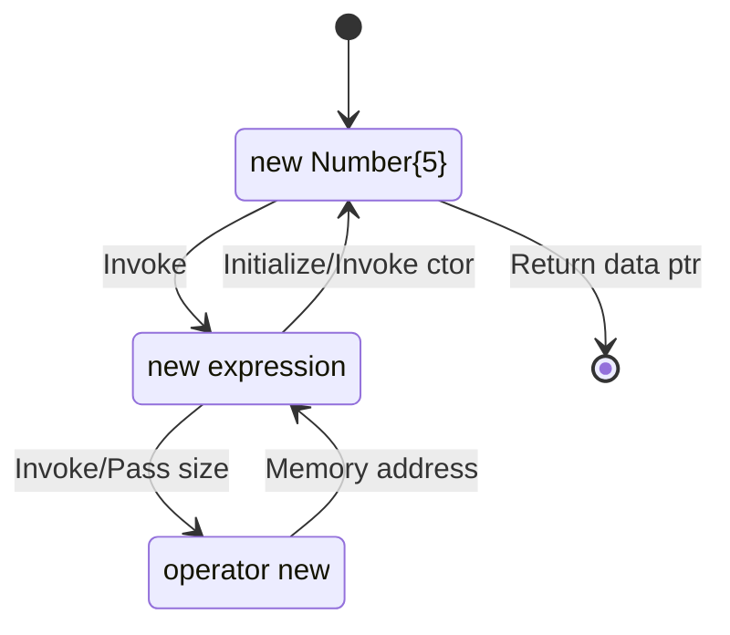

## C++ Allocation Operators

- **C++** provides only 2 operators for allocating dynamic memory: `new` and `delete`

- the operators have several forms:

  | operator   | description                                                  |
  | ---------- | ------------------------------------------------------------ |
  | `new`      | allocates memory and optionally initializes it (by calling constructor) |
  | `delete`   | releases memory after optionally calling a destructor        |
  | `new[]`    | allocates memory for an array                                |
  | `delete[]` | releases memory for an array                                 |

- these operators should be used in pairs, otherwise it will cause memory issues.

## new Expression & operator new

Given the following code for a memory allocation:

```c++
Number* ptr = new Number{5};		// support we have a parametrized ctor for class Number
```
{: .nolineno }

Here is a diagram showing how the memory is allocated and initialized, and finally return its address, use `delete` expression to deallocate the memory:



The `new[]` expression and `operator new` are working in the same way, and use `delete[]` to free the memory.

> Debug Tips: check disassembly of some release build
>
> - All the functions will return a value in the accumulator register, that register on 32-bit platform is `eax`.
> - make some local variable to global variable to prevent the code optimization
> - move the ctor/dtor definition out of class body, prevent compiler inline them
> - in the project property page, disable the **Inline Function Expansion** (can be found in _C/C++_ -> _Optimizations_)
>   
>
{: .prompt-tip }

The previous allocation statement's disassembly will be something like on a 32-bit machine, the same exact order as shown in the workflow graph:

```assembly
00ED1004  push        4
00ED1006  call        operator new (0ED106Ch)
00ED1008  mov         ecx,eax
00ED100D  mov         dword ptr [ebp-4],eax
00ED1010  call        Number::Number (0ED1050h)
00ED1015  mov         dword ptr [ptr (0ED33F4h)],eax
```
{: .nolineno }

## new Failure

There are in total 3 failure cases when use `new` to allocate the memory:

- throws an exception of type `bad_alloc` (default behavior)
- calls a function set by `set_new_handler` function
- returns `NULL` (if `nothrow` version of `new` is used)

### Exception

```c++
#include <climits>
#include <exception>
#include <iostream>

int* ptr[5]{};

int main()
{
    try
    {
        for(int i = 0; i < 5; ++i)
        {
            ptr[i] = new int[INT_MAX / 10];
        }
    }
    catch (std::exception& ex)
    {
        std::cout << "Exception: " << ex.what() << std::endl;
    }
    
    return 0;
}
```

This code will output a message as ***Exception: bad allocation***. If not make the allocation size larger.

### Handler

```c++
#include <climits>
#include <iostream>
#include <thread>

int* ptr[5]{};

void newHandler()
{
    using namespace std::chrone_literals;
    std::cout << "Failed to allocate memory" << std::endl;
    std::this_thread::sleep_for(1s);	// avoid high freq invoke
    
    // free some memory
    delete[] ptr[0];
    ptr[0] = nullptr;
}

int main()
{
    std::set_new_handler(newHandler);
    
    for(int i = 0; i < 5; ++i)
    {
        std::cout << "Allocating memory #" << i << std::endl;
        ptr[i] = new int[INT_MAX / 10];
        std::cout << "Success #" << i << std::endl;
    }
    
    return 0;
}
```

Now when the memory allocation fails, it will not throw an exception, instead, it will call this new handler function repeatedly. It will stop calling the handler when the memory is becoming avaiable again.

### Non-throwing new

- this `new` does not throw an exception if it fails to allocate the requested memory, but returns a `nullptr`
- useful when it may not be possible to catch the exception (as in `malloc`)
  - C++ code gets called from some extern code, the allocation exception cannot be caught
  - some application/library compiled with different compilers, no guarantee that exceptions can be caught

```c++
#include <climits>
#include <iostream>
#include <new>

int main()
{
    int* ptr = new(std::nothrow) int[INT_MAX / 5];
    if(ptr == nullptr)
    {
        std::cout << "Failed to allocate memory" << std::endl;
        return -1;
    }
    delete ptr;
    return 0;
}
```

This code will output a message as ***Failed to allocate memory***. If not make the allocation size larger.

> Debug Tips: step into specific (vs)
>
> - when debug some `new` expression/`operator new`, break the line and right click, there should be **Step Into Specific** available.
> 
{: .prompt-tip }

This nothrow new is handling the exception inside, if an exception is caught, then return a `nullptr`.