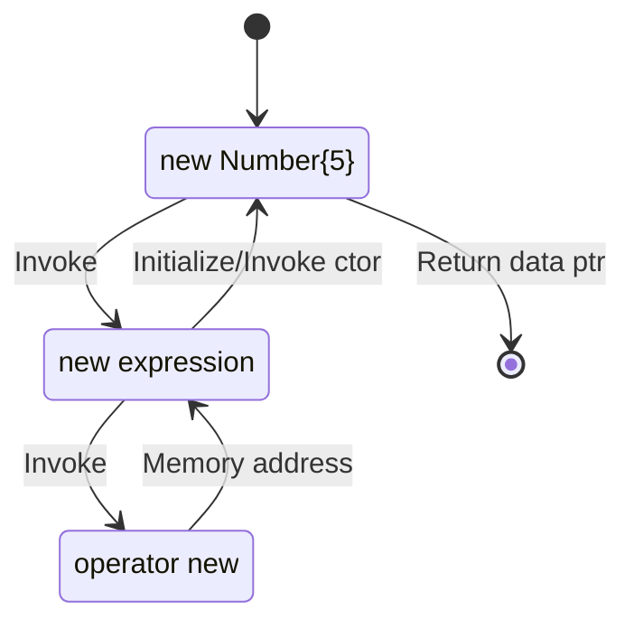

## C++ Allocation Operators

- **C++** provides only 2 operators for allocating dynamic memory: `new` and `delete`

- the operators have several forms:

  | operator   | description                                                  |
  | ---------- | ------------------------------------------------------------ |
  | `new`      | allocates memory and optionally initializes it (by calling constructor) |
  | `delete`   | releases memory after optionally calling a destructor        |
  | `new[]`    | allocates memory for an array                                |
  | `delete[]` | releases memory for an array                                 |

- these operators should be used in pairs, otherwise it will cause memory issues.

### new Expression & operator new

Given the following code for a memory allocation:

```c++
Number* ptr = new Number{5};		// support we have a parametrized ctor for class Number
```
{: .nolineno }

Here is a diagram showing how the memory is allocated and initialized, and finally return its address:


