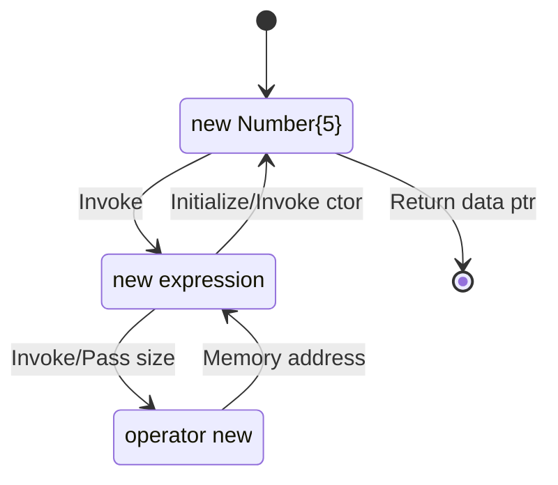

## C++ Allocation Operators

- **C++** provides only 2 operators for allocating dynamic memory: `new` and `delete`

- the operators have several forms:

  | operator   | description                                                  |
  | ---------- | ------------------------------------------------------------ |
  | `new`      | allocates memory and optionally initializes it (by calling constructor) |
  | `delete`   | releases memory after optionally calling a destructor        |
  | `new[]`    | allocates memory for an array                                |
  | `delete[]` | releases memory for an array                                 |

- these operators should be used in pairs, otherwise it will cause memory issues.

## new Expression & operator new

Given the following code for a memory allocation:

```c++
Number* ptr = new Number{5};		// support we have a parametrized ctor for class Number
```
{: .nolineno }

Here is a diagram showing how the memory is allocated and initialized, and finally return its address, use `delete` expression to deallocate the memory:



The `new[]` expression and `operator new` are working in the same way, and use `delete[]` to free the memory.

> Debug Tips: check disassembly of some release build
>
> - All the functions will return a value in the accumulator register, that register on 32-bit platform is `eax`.
> - make some local variable to global variable to prevent the code optimization
> - move the ctor/dtor definition out of class body, prevent compiler inline them
> - in the project property page, disable the **Inline Function Expansion**
>
{: .prompt-tip }

{: width="392" height="256" }
_Found in C/C++ -> Optimizations_

The previous allocation statement's disassembly will be something like on a 32-bit machine, the same exact order as shown in the workflow graph:

```assembly
00ED1004  push        4
00ED1006  call        operator new (0ED106Ch)
00ED1008  mov         ecx,eax
00ED100D  mov         dword ptr [ebp-4],eax
00ED1010  call        Number::Number (0ED1050h)
00ED1015  mov         dword ptr [ptr (0ED33F4h)],eax
```
{: .nolineno }

## new Failure

There are in total 3 failure cases when use `new` to allocate the memory:

- throws an exception of type `bad_alloc` (default behavior)
- calls a function set by `set_new_handler` function
- returns `NULL` (if `nothrow` version of `new` is used)

### Exception

```c++
#include <climits>
#include <exception>
#include <iostream>

int* ptr[5]{};

int main()
{
    try
    {
        for(int i = 0; i < 5; ++i)
        {
            ptr[i] = new int[INT_MAX / 10];
        }
    }
    catch (std::exception& ex)
    {
        std::cout << "Exception: " << ex.what() << std::endl;
    }
    
    return 0;
}
```

This code will output a message as ***Exception: bad allocation***. If not make the allocation size larger.

### Handler

```c++
#include <climits>
#include <iostream>
#include <thread>

int* ptr[5]{};

void newHandler()
{
    using namespace std::chrone_literals;
    std::cout << "Failed to allocate memory" << std::endl;
    std::this_thread::sleep_for(1s);	// avoid high freq invoke
    
    // free some memory
    delete[] ptr[0];
    ptr[0] = nullptr;
}

int main()
{
    std::set_new_handler(newHandler);
    
    for(int i = 0; i < 5; ++i)
    {
        std::cout << "Allocating memory #" << i << std::endl;
        ptr[i] = new int[INT_MAX / 10];
        std::cout << "Success #" << i << std::endl;
    }
    
    return 0;
}
```

Now when the memory allocation fails, it will not throw an exception, instead, it will call this new handler function repeatedly. It will stop calling the handler when the memory is becoming avaiable again.

### Non-throwing new

- this `new` does not throw an exception if it fails to allocate the requested memory, but returns a `nullptr`
- useful when it may not be possible to catch the exception (as in `malloc`)
  - C++ code gets called from some extern code, the allocation exception cannot be caught
  - some application/library compiled with different compilers, no guarantee that exceptions can be caught

```c++
#include <climits>
#include <iostream>
#include <new>

int main()
{
    int* ptr = new(std::nothrow) int[INT_MAX / 5];
    if(ptr == nullptr)
    {
        std::cout << "Failed to allocate memory" << std::endl;
        return -1;
    }
    delete ptr;
    return 0;
}
```

This code will output a message as ***Failed to allocate memory***. If not make the allocation size larger.

> Debug Tips: step into specific (vs)
>
> - when debug some `new` expression/`operator new`, break the line and right click, there should be **Step Into Specific** available.
> 
{: .prompt-tip }

This nothrow new is handling the exception inside, if an exception is caught, then return a `nullptr`.

## Placement new

- placement new is the form of `new` allocates memory at the address specified by the user
- placement new is quite handy for creating objects at designated memory locations:
  - embedded devices where objects may be stored at known locations
  - **memory pooling**: a memory pool is a large chunk of memory where certain areas are used by different objects, i.e. memory pages, to avoid fragments in the heap
- if an object is created using placement new, the following cases might be needed, depends on how memory was allocated:
  - the destructor may need to be called explicitly to delete the object
  - `delete` may need to be called explicitly to delete the object

- STL uses placement new in `std::shared_ptr`, container allocators, etc. 

>Syntax for placement new
>
>```text
>Type* ptr = new (<memory address>) Type{};
>```
>{: .nolineno }
>
{: .prompt-tip }

### Examples

#### Placement new on stack

Given a such **Example** class:

```c++
struct Example
{
    Example() { std::cout << "Example()" << std::endl; }
    Exmaple(int data) : m_data(data) { std::cout << "Example(int)" << std::endl; }
    ~Example() { std::cout << "~Example()" << std::endl; }
    
    Example& operator=(const Example& other) 
    {
        std::cout << "operator=(const Example&)" << std::endl;
        m_data = other.m_data;
        returm *this;
    }
private:
    int m_data;
};
```

As we want to create a such Example object on the **stackBuf**, the following code will work:

```c++
#include <iostream>
#include <new>

int main()
{
    char stackBuf[4];    // allocate some memory on stack
    Example* ptr = new(stackBuf) Example{};
    ptr->~Example();
    return 0;
}
```

Furthermore, if we want to create an array of Example object without knowing their initial values at compile time:

```c++ 
#include <iostream>
#include <new>

int main()
{
    constexpr int SIZE = 5;
    
    // use operator new to allocate memory first and use placement new to initialize the memory
    Example* ptr = static_cast<Example*>(operator new(SIZE * sizeof(Example)));
    for(int i = 0; i < SIZE; ++i)
    {
        new(ptr + i) Exmaple{ i * i };
    }
    
    // destroy the objects then deallocate memory
    for(int i = 0; i < SIZE; ++i)
    {
        ptr[i]->~Example();
    }
    operator delete(ptr);
    
    return 0;
}
```

#### A simple String class

This sized string class is designed as shown below:


_string class_

```c++
class String
{
public:
    String(const char* str)
    {
        void* ptr = operator new(SIZE + strlen(str) + 1);
        m_pBuffer = static_cast<char*>(new(ptr) size_t{ strlen(str) });
        strcpy_s(m_pBuffer + SIZE, strlen(str) + 1, str);
    }
    ~String() { operator delete(m_pBuffer); }

    size_t getLength() const { return *static_cast<size_t*>(m_pBuffer); }
    const char* getString() const { return m_pBuffer + SIZE; }

private:
    const static size_t SIZE = sizeof(size_t);
    char* m_pBuffer; // preserve 4bytes for the length
};
```

## Operator new & delete Functions

### Operator new Functions

| Expression                       | Function                                                   |
| -------------------------------- | ---------------------------------------------------------- |
| `T* p = new T;`                  | `void* operator new(std::size_t)`                          |
| `T* p = new(std::nothrow) T;`    | `void* operator new(std::size_t, const std::nothrow_t&)`   |
| `T* p = new(address) T;`         | `void* operator new(std::size_t, void*)`                   |
| `T* p = new(args...) T;`         | `void* operator new(std::size_t count, args...)`           |
| `T* p = new T[n];`               | `void* operator new[](std::size_t)`                        |
| `T* p = new(std::nothrow) T[n];` | `void* operator new[](std::size_t, const std::nothrow_t&)` |
| `T* p = new(address) T[n];`      | `void* operator new[](std::size_t, void*)`                 |
| `T* p = new(args...) T[n];`      | `void* operator new[](std::size_t count, args...)`         |

### Operator delete Functions

| Expression    | Function                                               |
| ------------- | ------------------------------------------------------ |
| `delete p;`   | `void operator delete(void*)`                          |
| --            | `void operator delete(void*, const std::nothrow_t&)`   |
| --            | `void operator delete(void*, void*)`                   |
| --            | `void operator delete(void*, args...)`                 |
| `delete[] p;` | `void operator delete(void*)`                          |
| --            | `void operator delete[](void*, const std::nothrow_t&)` |
| --            | `void operator delete[](void*, void*)`                 |
| --            | `void operator delete[](void*, args...)`               |

## malloc vs. new

| malloc                                            | new                                    |
| ------------------------------------------------- | -------------------------------------- |
| function                                          | operator                               |
| requires size during allocation                   | size is ascertained from the type      |
| cannot initialize memory                          | can initialize memory                  |
| cannot call constructors                          | can call constructors                  |
| returns void pointer that needs to be type casted | return correct type of pointer         |
| cannot be customized                              | can be customized through overloading  |
| `malloc`, `calloc` and `realloc`                  | has different forms                    |
| return `NULL` on failure                          | throws exception on failure by default |

