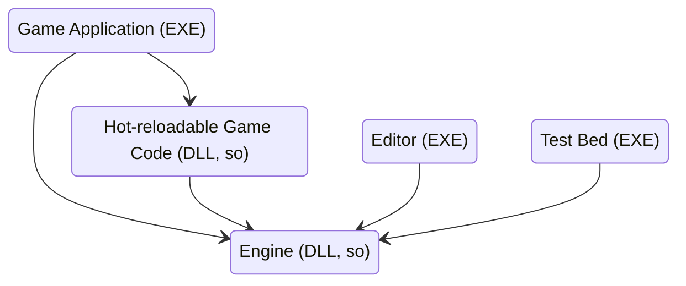
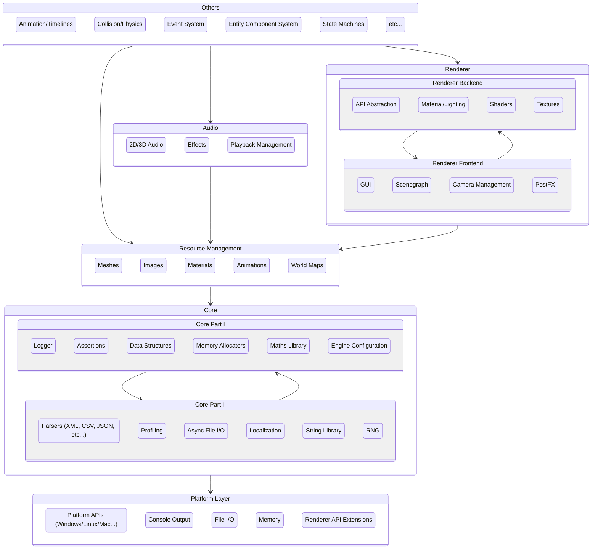

## Structure

This section is to briefly introduce what the game engine generally look like, in other words, these days, the game engine will probably need to have the following sections/features:

- a game application (which in form of executable, can be hot-reloadable through dlls or so depend on the target platforms)
- a editor application (which a collection of tools to help build game, and in form of executable)
- optionally a testbed (also an executable which is used to test all the engine features, usually not very structured)

## Features

Generally speaking, for a game engine, there following features should be provided (or preferred to have):

- build system (to help with generating the game build/editor executable etc...)
- low-level utilities:
  - dynamic arrays (similar to `std::vector`)
  - string handling,
  - etc...
- low-level platform layer
  - platform-wise windowing (for desktop platforms)
  - platform-wise input
  - platform-wise console interaction
  - etc...
- Logger
  - multi-threaded and performant
- File IO
  - some different file types as text, images, etc...
- Application layer
  - high-level implementation such as game loop
- Renderer/API Abstraction layer (large topic)
  - usually involves a frontend/backend system
  - backend communicates the lower level of the actual APIs
- Memory management (allocators etc...)
- Scene graph/ECS (Entity Component System)
- Profiling/Debugging utilities
- "Scripting" support via hot-reloading
- Physic system

## Architecture

It's worthy nothing that all the component listed in this diagram are in form of generic illustration, no detail provided.

There might be other important modules/elements not listed here, to be continued.

#### Note:

- RNG: Random Number Generator
