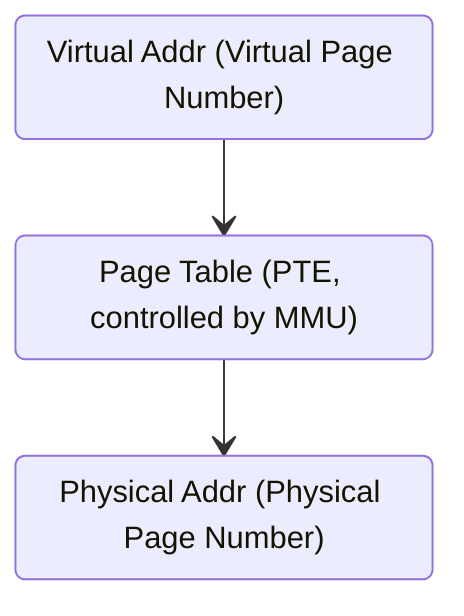
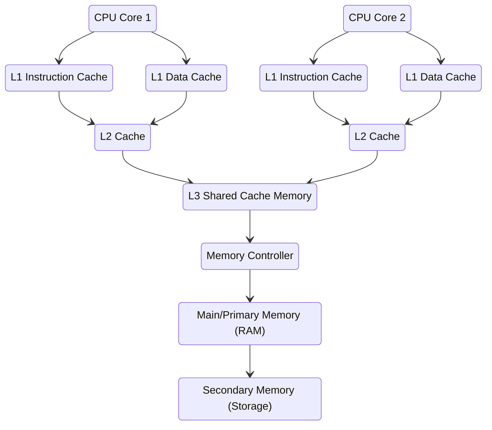

## Memory Translation

The translation happens between the virtual memory addresses and the physical memory addresses:

- The physical address space is the system RAM, also referred to as the global system memory
- The virtual address is controlled by the operating system

The workload access data in memory by looking up the physical memory that matches the virtual address. aka the memory translation/mapping.

### Page Table Entry (PTE)

The mapping is consist of page table entries, when data accessing happens:

### Word

One memory page in a PTE contains data structure with different sizes of ***words***:

- `WORD`: 16 bits/2 bytes
- `DWORD`: 32 bits/4 bytes
- `QWORD`: 64 bits/8 bytes

To make the mapping more efficient, the page tables are used to group chunks of memory addresses

- a page table for example can cover 4KB (1024 `DWORD`) instead 4B (1 `DWORD`)

### Translation Lookaside Buffer (TLB)

_MMU and TLB_

A translation lookaside buffer is a memory cache that stores the recent translation of virtual memory to physical memory.

It's used to reduce the time taken to access a user memory location, can also be called an Address-Translation Cache.

It's a part of Memory-Management Unit (MMU), lives inside the CPU package, access TLB is faster than the main memory.

#### TLB Hit

#### TLB Miss

#### Retrieve from Storage

- page number 0 is retrieved in memory but the data not residing in memory, but on storage
- page fault is triggered
- wait for the data loaded from storage (very slow)

## Memory Hierarchy

- reading data which is not cached is really time-consuming
- the L1/L2/L3 cache size usually small, due to the high-speed cache register is very expensive and the space for the register is also quite limited:
  - L1 instruction cache: usually 4KB - 128KB
  - L1 data cache: usually 8KB - 256KB
  - L2 cache: usually 128KB - 8MB
  - L3 cache: usually 4MB - 64MB

## Reference

- [Translation lookaside buffer](https://en.wikipedia.org/wiki/Translation_lookaside_buffer)
- [How is Virtual Memory Translated to Physical Memory](https://blogs.vmware.com/vsphere/2020/03/how-is-virtual-memory-translated-to-physical-memory.html)

