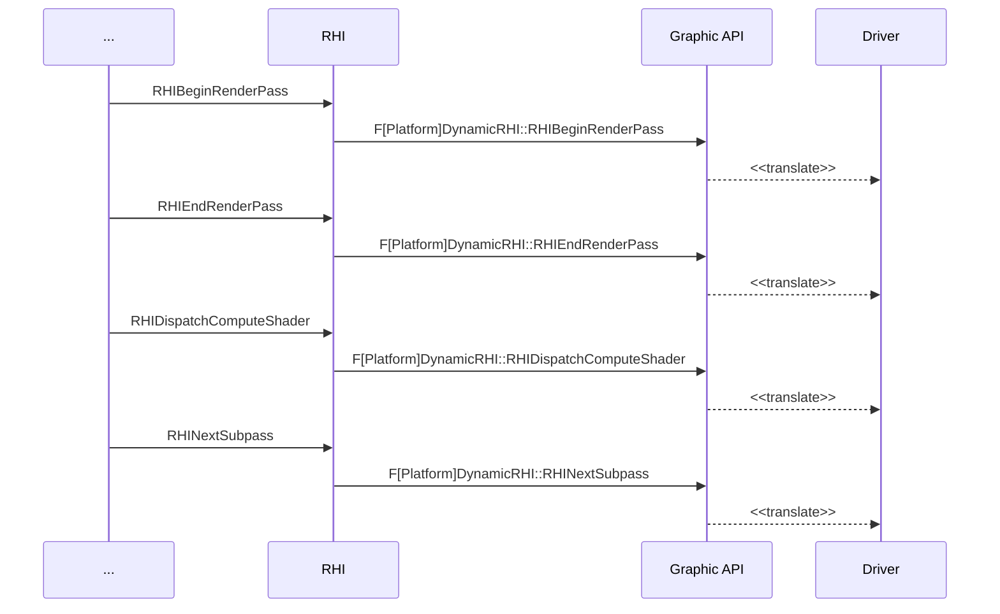
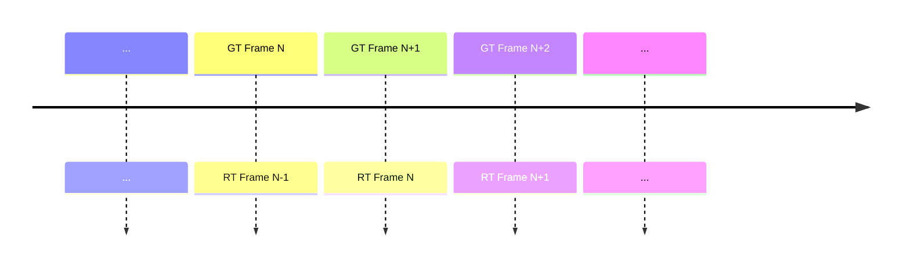
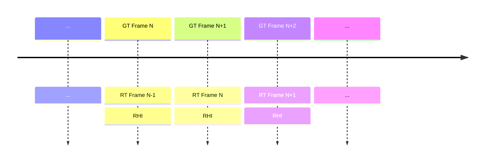
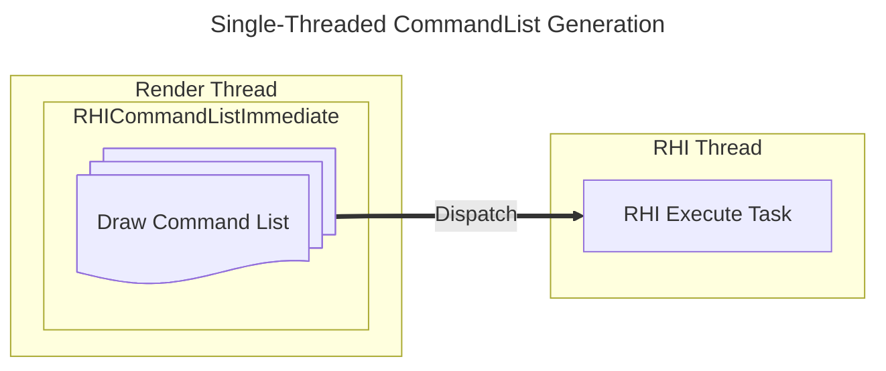
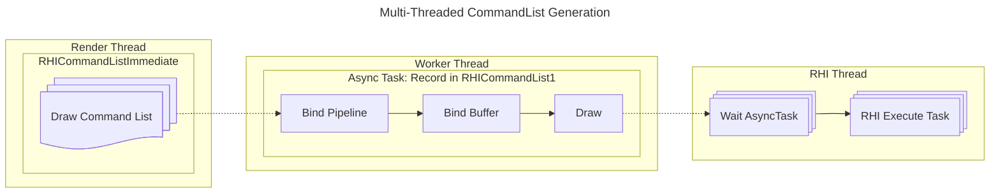

## Basic Concepts

If we have a lot of objects to render as the CitySample project, if the entire game has only one thread, the bottleneck will fall on CPU with no doubt, because GPU has the capaticity to process tasks in parallel, and with Nanite and TSR, GPU can be fully handle the scenario where loads of objects need processing.

One of the most common and effective method to optimize CPU is to improve the parallelism of the rendering.

- Take full advantage of the CPU's multi-core hardware resource to improve the rendering efficiency
  - Multi-threaded generation and translation of RHI commands
  - Multi-threaded creation and update of RHI resources
- Multi-threaded rendering is not a silver bullet for all low rendering performance issues, as single-threaded rendering is preferable for games that can achieve expected performance with single thread.
  - Multi-threaded rendering can take up more CPU resources, which is a waste
- The order of the RHI command submissions cannot be changed
  - the same order as being submitted in a single thread
  - the command execution order should be the same on GPU, otherwise, the rendering results may differ.

### RHI

RHI is the acronym of <u>*Rendering Hardware Interface*</u>, which is the cross-platform **wrapper** of graphic API used for high level renderer.



We can see from here that RHI is platform agnostic, as for the parallelization of game rendering process, we can also categorize it into 2 parts:

- Frontend: platform-agnostic 
- Backend: platform (D3D12, Vulkan, Metal) parallelization

>Graphics API vs. Graphics Driver
>
>- A graphics API is a set of commands that allow application to communicate with the graphics hardware.
>- A graphics driver is the software that translates these commands and makes the hardware (GPU) perform the tasks.
{: .prompt-info }

### Render Thread (RT)

An simple example of the multi-threaded rendering is to separate a rendering thread from the main thread (Game Thread, GT), and let it focus on rendering activities.



With all rendering stuff being moved to render thread, game thread no longer needs to wait for the rendering, it can continue to process, and only wait for the rendering result at the end of the next frame.

In this case, game thread and render thread will have 1 frame lag and they can execute in parallel

### RHI Thread

As we already presented what RHI is in the previous section, now we take a look at why we need another thread for the RHI.

When we call a RHI function, it firstly calls the driver, some RHI function can be expensive, i.e. OpenGL. Many RHI calls can slow down the render thread because it needs wait for the RHI calls' return signal, and most of the time cost by RHI calls is actually spent on the driver.

- Render Thread Only

  *All RHI cost will be added into rendering thread, which could make it really slow.*

  ```mermaid
  flowchart TB
      subgraph Render Thread
      ... --> RHI
      subgraph RHI
      Driver
      end
      end
  ```

- Render Thread with RHI Thread

  *The render commands will be executed on RHI thread, which frees render thread.*

  ```mermaid
  flowchart LR
      subgraph RT [Render Thread]
      ...
      end
      subgraph RHI [RHI Thread]
      Driver
      end
      RT --> RHI
  ```


With a separate RHI thread, render thread can focus on the rendering logic tasks, i.e. model culling, as the specific render commands, they can be sent out to the RHI thread:



Render thread can send the render commands in the middle of one frame multiple times, and wait for RHI thread to finish at the beginning of the next  frame. We now have a RHI thread which executes in parallel with render thread.

Before sent out to RHI thread, the render commands are pre-recorded and saved into a render command list by render thread first, to improve the work efficiency.

## Frontend (RHI Command Generation)

To parallelize the frontend part of the rendering, in UE, there are some structs created for tackling down the information required by the graphics API.

| Struct Name                | Notes                                                        |
| -------------------------- | ------------------------------------------------------------ |
| `FRHICommandBase`          | - A small class stores the data for executing RHI api, provide an interface `Execute` for overriding<br />- macros to create command struct (ref. ***RHICommandList.h***):<br />- `FRHICOMMAND_UNNAMED`, `FRHICOMMAND_UNNAMED_TPL`, `FRHICOMMAND_MACRO`, `FRHICOMMAND_MACRO_TPL` |
| `FRHICommandList`          | - A container of RHI functions which can be delayed for execution<br />- Track and Save RHI commands to a linked list `CommandLink`<br />- `Bypass()` means the render commands are executed immediately instead of being recorded |
| `FRHICommandListImmediate` | - Derived from `FRHICommandList`<br />- Including some render commands that need to be executed immediately on rendering thread and may need to flush RHI thread<br />- Singleton instance |

The render task execution order in RHI thread



The reason for `RHICommandListImmediate` being singleton is we need to make sure that the RHI commands submitted from render thread get executed in the order that we expect. Eventually all the RHI commands will be recorded within `RHICommandListImmediate`, then sent to RHI thread to execute.

Render thread can dispatch the commands multiple times within 1 frame, in order to guarantee the order of the tasks created on RHI thread unchanged, when a new tasks gets created, the previous task will be set to the new task's dependency.



Since no specific hardware is required in the CommandList Generation, this part of the rendering can be considered as **agnostic** and can be used on all the platforms (including mobiles).

## Backend (RHI Command Translation)

UE has an interface class `IRHICommandContext` which is used to translate the RHI command to its corresponding GPU's graphics instructions:

| Interface            | Notes                                                        |
| -------------------- | ------------------------------------------------------------ |
| `IRHIComputeContext` | - including interfaces for doing compute work. i.e. `RHIDispatchComputeShader` |
| `IRHICommandContext` | Derives from `IRHIComputeContext`:<br />- Including extra interfaces for doing graphics work, i.e. `RHIBeginRenderPass`<br />- Main interface used in translation of `FRHICommandList`<br />- Each platform has its own derived RHICommandContext: `FD3D12CommandContext`, `FMetalRHICommandContext`, etc<br />- Responsible for caching state, validation and issue, i.e. perform a write op on a read-only buffer<br />- Platforms with an immediate context send RHI commands to GPU directly (OpenGL)<br />- Platforms with an deferred context write RHI commands to a command buffer and can be multi-threaded (D3D12, Vulkan, Metal, ...) |

#### Example (Vulkan)

| Concept         | Notes                                                        |
| --------------- | ------------------------------------------------------------ |
| `Queue`         | - `Queue` from a `Family` can accept one of the following work: **Graphics**, **Computes**, **Transfer**, etc<br />- Command buffers are submitted to a `Queue` for GPU consumption |
| `DescriptorSet` | - Allocated from a `DescriptorPool`, can hold multiple types of `DescriptorSet`, i.e. **sampler**, **uniform buffer**, etc<br />- `DescriptorSets` from the same pool can be written to/by different threads (friendly for multi-threaded rendering, on OpenGL it needs to be in the same context which is usually bound to one thread) |

