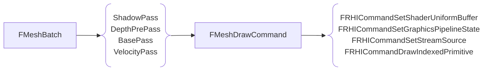

## Basic Concepts

If we have a lot of objects to render as the **CitySample** project, if the entire game has only one thread, the bottleneck will fall on CPU with no doubt, because GPU has the capacity to process tasks in parallel, and with Nanite and TSR, GPU can be fully handle the scenario where loads of objects need processing.

One of the most common and effective method to optimize CPU is to improve the parallelism of the rendering.

- Take full advantage of the CPU's multi-core hardware resource to improve the rendering efficiency
  - Multi-threaded generation and translation of RHI commands
  - Multi-threaded creation and update of RHI resources
- Multi-threaded rendering is not a silver bullet for all low rendering performance issues, as single-threaded rendering is preferable for games that can achieve expected performance with single thread.
  - Multi-threaded rendering can take up more CPU resources, which is a waste
- The order of the RHI command submissions cannot be changed
  - the same order as being submitted in a single thread
  - the command execution order should be the same on GPU, otherwise, the rendering results may differ.

### RHI

RHI is the acronym of <u>*Rendering Hardware Interface*</u>, which is the cross-platform **wrapper** of graphic API used for high level renderer.


We can see from here that RHI is platform agnostic, as for the parallelization of game rendering process, we can also categorize it into 2 parts:

- Frontend: platform-agnostic 
- Backend: platform (D3D12, Vulkan, Metal) parallelization

>Graphics API vs. Graphics Driver
>
>- A graphics API is a set of commands that allow application to communicate with the graphics hardware.
>- A graphics driver is the software that translates these commands and makes the hardware (GPU) perform the tasks.
{: .prompt-info }

### Render Thread (RT)

An simple example of the multi-threaded rendering is to separate a rendering thread from the main thread (Game Thread, GT), and let it focus on rendering activities.


With all rendering stuff being moved to render thread, game thread no longer needs to wait for the rendering, it can continue to process, and only wait for the rendering result at the end of the next frame.

In this case, game thread and render thread will have 1 frame lag and they can execute in parallel

### RHI Thread

As we already presented what RHI is in the previous section, now we take a look at why we need another thread for the RHI.

When we call a RHI function, it firstly calls the driver, some RHI function can be expensive, i.e. OpenGL. Many RHI calls can slow down the render thread because it needs wait for the RHI calls' return signal, and most of the time cost by RHI calls is actually spent on the driver.

- Render Thread Only

  *All RHI cost will be added into rendering thread, which could make it really slow.*

  ```mermaid
  flowchart TB
      subgraph Render Thread
      ... --> RHI
      subgraph RHI
      Driver
      end
      end
  ```

- Render Thread with RHI Thread

  *The render commands will be executed on RHI thread, which frees render thread.*

  ```mermaid
  flowchart LR
      subgraph RT [Render Thread]
      ...
      end
      subgraph RHI [RHI Thread]
      Driver
      end
      RT --> RHI
  ```


With a separate RHI thread, render thread can focus on the rendering logic tasks, i.e. model culling, as the specific render commands, they can be sent out to the RHI thread:


Render thread can send the render commands in the middle of one frame multiple times, and wait for RHI thread to finish at the beginning of the next  frame. We now have a RHI thread which executes in parallel with render thread.

Before sent out to RHI thread, the render commands are pre-recorded and saved into a render command list by render thread first, to improve the work efficiency.

## Frontend

### Concepts

To parallelize the frontend part of the rendering, in UE, there are some structs created for tackling down the information required by the graphics API.

| Struct Name                | Notes                                                        |
| -------------------------- | ------------------------------------------------------------ |
| `FRHICommandBase`          | - A small class stores the data for executing RHI api, provide an interface `Execute` for overriding<br />- macros to create command struct (ref. ***RHICommandList.h***):<br />- `FRHICOMMAND_UNNAMED`, `FRHICOMMAND_UNNAMED_TPL`, `FRHICOMMAND_MACRO`, `FRHICOMMAND_MACRO_TPL` |
| `FRHICommandList`          | - A container of RHI functions which can be delayed for execution<br />- Track and Save RHI commands to a linked list `CommandLink`<br />- `Bypass()` means the render commands are executed immediately instead of being recorded |
| `FRHICommandListImmediate` | - Derived from `FRHICommandList`<br />- Including some render commands that need to be executed immediately on rendering thread and may need to flush RHI thread<br />- Singleton instance |

### RHI Command Generation

Generation is used to convert RHI commands to `RHICommandList`.


The reason for `RHICommandListImmediate` being singleton is we need to make sure that the RHI commands submitted from render thread get executed in the order that we expect. Eventually all the RHI commands will be recorded within `RHICommandListImmediate`, then sent to RHI thread to execute.

Render thread can dispatch the commands multiple times within 1 frame, in order to guarantee the order of the tasks created on RHI thread unchanged, when a new tasks gets created, the previous task will be set as the new task's dependency.


Since no specific hardware is required in the CommandList Generation, this part of the rendering can be considered as **agnostic** and can be used on all the platforms (including mobiles).

## Backend

### Concepts

UE has an interface class `IRHICommandContext` which is used to translate the RHI command to its corresponding GPU's graphics instructions:

| Interface            | Notes                                                        |
| -------------------- | ------------------------------------------------------------ |
| `IRHIComputeContext` | - including interfaces for doing compute work. i.e. `RHIDispatchComputeShader` |
| `IRHICommandContext` | Derives from `IRHIComputeContext`:<br />- Including extra interfaces for doing graphics work, i.e. `RHIBeginRenderPass`<br />- Main interface used in translation of `FRHICommandList`<br />- Each platform has its own derived RHICommandContext: `FD3D12CommandContext`, `FMetalRHICommandContext`, etc<br />- Responsible for caching state, validation and issue, i.e. perform a write op on a read-only buffer<br />- Platforms with an immediate context send RHI commands to GPU directly (OpenGL)<br />- Platforms with an deferred context write RHI commands to a command buffer and can be multi-threaded (D3D12, Vulkan, Metal, ...) |

#### Example (Vulkan)

| Concept         | Notes                                                        |
| --------------- | ------------------------------------------------------------ |
| `Queue`         | - `Queue` from a `Family` can accept one of the following work: **Graphics**, **Computes**, **Transfer**, etc<br />- Command buffers are submitted to a `Queue` for GPU consumption |
| `DescriptorSet` | - Allocated from a `DescriptorPool`, can hold multiple types of `DescriptorSet`, i.e. **sampler**, **uniform buffer**, etc<br />- `DescriptorSets` from the same pool can be written to/by different threads (friendly for multi-threaded rendering, on OpenGL it needs to be in the same context which is usually bound to one thread) |

The render commands will firstly be stored in a command buffer, after them being translated from RHI commands, then submitted to a `Queue`. One `Queue` can hold multiple command buffer, of which the execution order remains the same as the submission order. 

#### Command Buffer

| Concept                                | Notes                                                        |
| -------------------------------------- | ------------------------------------------------------------ |
| `CommandBuffer`                        | - also called as `PrimaryCommandBuffer`<br />- used for recording RHI commands<br />- **can't** be reused while it's used already by GPU<br />- **can** be single or multi-threaded used, the execution order is the order submitted to a queue<br />- no state is inherited across command buffers |
| `SecondaryCommandBuffer`<br />(vulkan) | - created from a command buffer and used for recording RHI commands<br />- the parent command buffer **can't** record normal RHI commands<br />- the execution order follows the `vkCmdExecuteCommands` execution order<br />- no state is inherited **except** the `RenderPass` state |

The command buffers are independent to each other even they are included in the same `Queue`, any dependency would crash the GPU. i.e. we can't put `BeginRenderPass` in one command buffer and put `EndRenderPass` in another.

`PrimaryCommandBuffer` could have multiple `SecondaryCommandBuffer` to submit render command separately. The execution order will be the same as the order that they are pushed to the `PrimaryCommandBuffer`.

### RHI Command Translation

Translation is used to convert `RHICommandList` to Command Buffer (each Command Buffer is usually handle by one thread).


If a render pass is translated to command buffer in multi-threaded way, then in each one of the command buffer, there should be `BeginRenderPass` and `EndRenderPass` inside. Each Begin/End `RenderPass` is equivalent to render target's load and store, which could be a serious performance issue, especially for mobile devices.

For mobile devices, it's better to use `SecondaryCommandBuffer` to achieve parallel commandList translation:


#### Parallel Translation Support

| Supported RHI                                            | Unsupported RHI                                             |
| -------------------------------------------------------- | ----------------------------------------------------------- |
| - console RHI (PS4, PS5, ...)<br />- D3D12<br />- Vulkan | - OpenGL (`CommandListImmediate`)<br />- D3D11<br />- Metal |

- Vulkan currently doesn't use `SecondaryCommandBuffer` even though it's supported, therefore it's not quite suitable for mobile devices
- D3D11 and Metal should support parallel RHI command translation theoretically, however not implemented in UE yet (to verify)

## Synchronization

Here are some systems or methods in UE for frontend-backend synchronization:

| Frontend                                                     | Backend (For different scenarios)       |
| ------------------------------------------------------------ | --------------------------------------- |
| - Taskgraph system (upgraded in UE5)<br />  - Prerequisite tasks<br />  - Join (at the proper timing) | - Barrier<br />- Fence<br />- Semaphore |

## Applications

This section will be introducing the engine components which are using the parallel rendering.

### Concepts

Here is an overall pipeline for recording CommandList, the details for each separate node will be listed in the following sections.


#### High Level Data Structures

| Data Structure         | Notes                                                        |
| ---------------------- | ------------------------------------------------------------ |
| `FPrimitiveSceneProxy` | - The rendering thread representation for the game thread's `UPrimitiveComponent`<br />- Provides `FMeshBatch` to Renderer through `GetDynamicMeshElements()` and `DrawStaticElements()` |
| `FMeshBatch`           | - Contains everything a pass needs to figure out final shader bindings and render state<br />- Provides `FMeshDrawCommand` used by a mesh pass through specific `FMeshPassProcessor` |
| `FMeshDrawCommand`     | - Stores everything that the RHI needs to know about a mesh draw<br />- Allows for caching and merging the draw calls just above the RHI level |

- `FMeshBatch` contains all render information about the primitive in any mesh pass, i.e. `DepthPrePass`, `BasePass` (they are all mesh passes)
- `FMeshDrawCommand` contains all RHI information about the primitive, i.e. shader, vertex information, and texture bindings.
- If mesh render state won't change, we can precache the mesh draw command, to avoid generating the same draw command repeatedly.
- if multiple mesh draw commands use the same vertices and shader, and `GPUScene` is enabled as well, we can merge these commands



#### Init Views


- `FMeshDrawCommand` will be generated in these `FMeshDrawCommandPassSetupTask` async tasks, however they are not required in the `InitView` stage, no need to wait for them.

#### Parallel in RenderDependencyGraph

For the render passes, UE manages them via `RenderDependencyGraph` (todo), to process them in a parallel way.

1. Collect all render passes, through RDG

2. Setup render passes (in parallel), following these steps:

   ```mermaid
   flowchart LR
   	Compile["Compile (SetupPassResources)"] --> CompilePassBarriers
   	CompilePassBarriers --> SubmitBufferUploads
   	SubmitBufferUploads --> CreateUniformBuffer
   	CreateUniformBuffer --> CreatePassBarriers
   ```

3. Execute render passes (in parallel):

   1. `SetupParallelExecute`: Collect a serial passes using `RHICommandList` to a `ParallelPassSet`

      1. this is because we don't expect an result immediately from `RHICommandList`, which means if a render pass uses `RHICommandList`, then all the instructions in this pass can be parallelized.
      2. 2 console variables which can be used to minmax the amount of `RHICommandList` merged into one `ParallelPassSet`:
         - `r.RDG.ParallelExecute.PassMin` (default: 1)
         - `r.RDG.ParallelExecute.PassMax` (default: 32)

      | Pass | Before SetupParallelExecute | After SetupParallelExecute |
      | ---- | --------------------------- | -------------------------- |
      | 1    | RHICommandListImmediate     | RHICommandListImmediate    |
      | 2    | RHICommandList|**ParallelPassSet**       |
      | 3    | RHICommandList              | -- (merged) |
      | 4    | RHICommandList              | -- (merged) |
      | 5    | RHICommandListImmediate     | RHICommandListImmediate    |
      | 6    | RHICommandList              | **ParallelPassSet**        |
      | 7    | RHICommandList              | -- (merged) |
      | 8    | RHICommandListImmediate     | RHICommandListImmediate    |
      | 9    | RHICommandList              | **ParallelPassSet**        |

   2. `DispatchParallelExecute`: Launch an async task for each `ParallelPassSet` to execute each pass (record render commands in a `RHICommandList`).

      - The reason why we don't execute on every single one of the passes, is that in general, the render passes uses `RHICommandList` are small, no as large as mesh passes, i.e. compute pass or post process pass, so relatively they don't have too many render instructions. By grouping them together can effectively improve the work efficiency.
      - On the other hand, mesh passes use `RHICommandListImmediate`

   3. Record passes and `ParallelPassSet` in series:

      | Pass | Execute Pass        | RHICommandListImmediate |
      | ---- | ------------------- | ----------------------- |
      | 1    | -- (no-op)          | Record Pass 1           |
      | 2    | **ParallelPassSet** | RHICommandList          |
      | 3    | -- (merged)         |                         |
      | 4    | -- (merged)         |                         |
      | 5    | -- (no-op)          | Record Pass 5           |
      | 6    | **ParallelPassSet** | RHICommandList          |
      | 7    | -- (merged)         |                         |
      | 8    | -- (no-op)          | Record Pass 8           |
      | 9    | **ParallelPassSet** | RHICommandList          |

      `RHICommandListImmediate` can ensure the execution order remains the same.

#### Parallel MeshDrawCommand Pass

If the render pass is a mesh pass, there are some furthermore optimizations:

1. Break `MeshDrawCommands` in this mesh pass up into chunks based on some criteria 

2. The number of chunks will be determined by the following concepts, to help balance the work load for each worker thread:

   | Concept           | Definition                                                   |
   | ----------------- | ------------------------------------------------------------ |
   | `NumThreads`      | Min(`NumWorkerThreads`, `r.RHICmdWidth`)                     |
   | `NumTasks`        | Min(`NumThreads`, (MaxNumDraws / `r.RHICmdMinDrawsPerParallelCmdList`)) |
   | `NumDrawsPerTask` | (MaxNumDraws/`NumTasks`)                                     |


#### Parallel CommandList Generation


#### Parallel CommandList Translation

This is usually done in `FRHICommandListImmediate::QueueAsyncCommandListSubmit`:


### Summary

| Steps                            | Notes                                                        |
| -------------------------------- | ------------------------------------------------------------ |
| Parallel Processing Resources    | - `ComputeLightVisibility`, `PrimitiveCulling`, `ComputeAndMarkRelevance`, `SetupMeshPass`, ...<br />- Parallel pass setup in RDG |
| Parallel CommandList Generation  | - `DispatchParallelExecute`, `FParallelCommandListSet` in mesh pass |
| Parallel CommandList Translation | - `FRHICommandListImmediate::QueueAsyncCommandListSubmit` (only for mesh pass) |

## Debugging

| Name                             | CVars                                                        | Launch Params                    |
| -------------------------------- | ------------------------------------------------------------ | -------------------------------- |
| `Bypass`                         | - `r.RHICmdBypass`                                           | `-forcerhibypass`                |
| `GRHISupportsRHIThread`          | - `r.Metal.IOSRHIThread`<br />- `r.OpenGL.AllowRHIThread`<br />- `r.Vulkan.RHIThread` | `-rhithread`<br />`-norhithread` |
| `GRHISupportsParallelRHIExecute` | - `r.Vulkan.RHIThread` (> 1)                                 |                                  |

