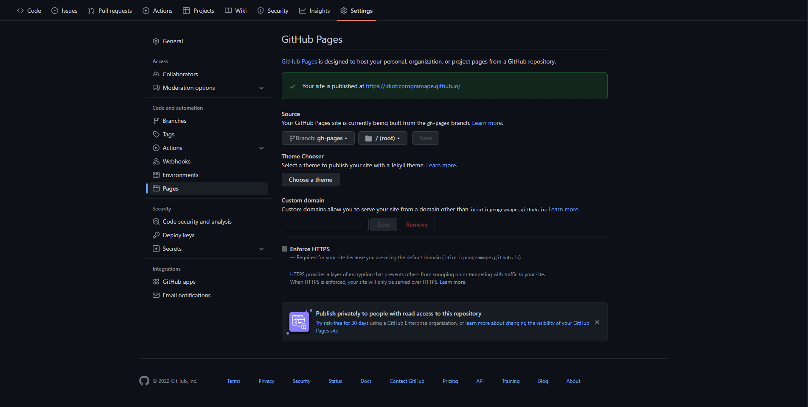

<details open markdown="block">
  <summary>
    Table of contents
  </summary>
  {: .text-delta }
1. TOC
{:toc}
</details>

## Prerequistes

There are a few things that need to be done before setting it up.

* Github account & git
* Ruby env (if use [jekyll](http://jekyllrb.com/))

## Create Github Repo

Here are some tips for this repo:

* name has a pattern as: `<your-github-username>.github.io`, to make sure the name is unique

  * seems `.github.com` also works
* in the **Settings**, find the **Pages** subpage

  
* (optional) choose a theme by clicking `Choose a theme` or configure it later using Jekyll.
* clone it to local.

> Notes:
>
> * If misspelled the username, the page url can be unexpected, such as:
>   * ~~https://idioticprogramape.github.io/idiotprogramape.github.io/~~ 👀️

## Create Jekyll Project

### Install Jekyll

Just copy paste from Jekyll's website here, this only works on **Windows**, for other OS, need to check these [Guides](https://jekyllrb.com/docs/installation/#guides):

1. Download and install a **Ruby+Devkit** version from [RubyInstaller Downloads](https://rubyinstaller.org/downloads/). Use default options for installation.
2. Run the `ridk install` step on the last stage of the installation wizard. This is needed for installing gems with native extensions. You can find additional information regarding this in the [RubyInstaller Documentation](https://github.com/oneclick/rubyinstaller2#using-the-installer-on-a-target-system). From the options choose `MSYS2 and MINGW development tool chain`.
3. Open a new command prompt window from the start menu, so that changes to the `PATH` environment variable becomes effective. Install Jekyll and Bundler using `gem install jekyll bundler`
4. Check if Jekyll has been installed properly: `jekyll -v`

### Initialize Jekyll site

1. open a terminal, and **cd** to the local repository
2. set up a jekyll project by exec: `jekyll new .`
3. add `webrick` to the dependencies by exec: `bundle add webrick`
4. build the site: `bundle exec jekyll serve --incremental --livereload`
5. check [http://localhost:4000](http://localhost:4000/)

### Apply Theme

#### Install Theme

Some links where can find more themes:

* [GitHub.com #jekyll-theme repos](https://github.com/topics/jekyll-theme)
* [jamstackthemes.dev](https://jamstackthemes.dev/ssg/jekyll/)
* [jekyllthemes.org](http://jekyllthemes.org/)
* [jekyllthemes.io](https://jekyllthemes.io/)

#### Some Fix

Use [just-the-docs](https://github.com/just-the-docs/just-the-docs) to start with.

* In the file **_config.yaml**, there are 2 keywords for theme:
  * **remote_theme**: this one is for github, so that the online site can be built with the correct theme
  * **theme**: this one is for offline debugging.
* After search data initialization(to enable search functionality), a json file was generated at: *assets/js/zzzz-search-data.json*
  * this file name is not consistent with its **permalink**, need to unify them
  * a small syntax error to fix:

    ```diff
    - {**%- assign pages_array =  | split:  -%**}
    + {**%- assign pages_array =  split:  -%**}
    ```

### Configure Theme

Some specific params described in [here](https://just-the-docs.github.io/just-the-docs/docs/configuration/).

Use **_config.yaml** from their Github repo as a start.

## More Sections & Pages

Ref: [Navigation Structure](https://just-the-docs.github.io/just-the-docs/docs/navigation-structure/).
