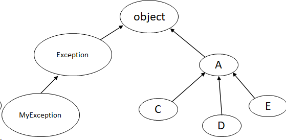
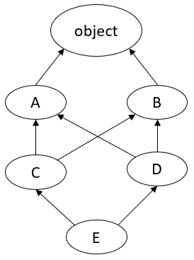
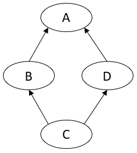

<details open markdown="block">
  <summary>
    Table of contents
  </summary>
  {: .text-delta }
1. TOC
{:toc}
</details>

## Syntax

```python
class Person:
    def __init__(self, name):
        self.name = name
        
    def __str__(self):
        return f"I'm {self.name}"
    
class Student(Person):
    def __init__(self, name, student_id):
        self.id = student_id
        super().__init__(name)	# equivalent to `Person.__init__(self, name)`
        
    def report(self):
        return self.id
```

- If a class is not inherit from anything like `Person`, it implicitly inherit from `object` class, can also make it explicitly as `class Person(object): ...`
- `__init__` is itself a process of registering and completing `self`

## Single Inheritance 

### Diagram



```python
class A(object): ...
class C(A): ...
class D(A): ...
class E(A): ...

class MyException(Exception):
    def __init__(self, msg):
        super().__init__(msg)
        print("MyException is raised")

print(C.__bases__)	# output is (__main__.A,)
raise MyException('test')	# will crash the program
```

### Method Resolution Order

Taking the example in the section [Single Inheritance Diagram](#Single Inheritance), suppose we need to call method `foo()` in `c` one instance of class `C`, we need to know where this `foo()` is defined, the lookup order should be

```text
C -> A -> object 
```

## Multiple Inheritance 

### Diagram



```python
class A(object): ...
class B(object): ...
class C(A, B): ...
class D(B, A): ...	# inheritance order is different!
class E(C, D): ...

print(E.__bases__)  # this will raise a TypeError: Cannot create a consistent method resolution order (MRO) for bases A, B 
```

Suppose we call `e.foo()` where `e` is an instance of class `E`, this will throw a `TypeError`, because the inheritance is **TOO** ambiguous.
The lookup order will be determined by an algorithm called **C3 Linearization**.

### C3 Linearization

Goal is to compute the MRO (Linearization `L`) of a class `X(Y_1, Y_2, ... Y_n)`

- let the **head** of a list be the first element (`[0]`)
- let the **tail** of a list be everything after the first element (`[1:]`)
- let the $ merge(list_1, list_2, ..., list_n) $ be:
  - find the first **head** that is not in the **tail** of any other list
  - append it to the output list
  - remove it from input lists
  - repeat until all input lists are empty
- $ L(X) = [X] + merge(L(Y_1), L(Y_2), ..., L(Y_n), [Y_1, Y_2, ..., Y_n]) $
  - where `X.__bases__ = (Y_1, Y_2, ..., Y_n)`


Some examples:

- $ L(object) = [object] $
- $ L(B) = [B, object] $
- $ L(C) $
  - step 1: $ L(C) = [C] + merge(L(A), L(B), [A, B]) $
  - step 2: $ L(C) = [C] + merge([A, object], [B, object], [A, B]) $
  - step 3: $ L(C) = [C, A, B, object] $
- $ L(D) = [D, B, A, object] $, here the inheritance order matters.
- $ L(E) $
  - step 1: $ L(E) = [E] + merge(L(C), L(D), [C, D]) $
  - step 2: $ L(E) = [E] + merge([C, A, B, object], [D, B, A, object], [C, D]) $
  - step 3: $ L(E) = [E, C, D] + merge([A, B, object], [B, A, object]) $, error, since A is in tail of second list and B is in tail of first list, they interlocked each other, the order cannot be resolved.

Notice that in the last example, it explains why our code in [Multiple Inheritance Diagram](#Multiple Inheritance ) fails to compile, according to C3, it failed to construct this class's mro, therefore crash. More details, check [C3 linearization - Wikipedia](https://en.wikipedia.org/wiki/C3_linearization)

## `super()`

To make `super()` works as we expected, it takes references from the **mro** and return **the next class from the mro list**, the real question is **whose** mro list.



```python
class A:
    def foo(self):
        print('A')
        
class B(A):
    def foo(self):
        super().foo()

class D(A): 
    def foo(self):
        print('D')
        
class C(B, D): ...

B().foo()	# output A, mro is [B, A, object]
C().foo()	# output D, mro is [C, B, D, A, object]
```

`C().foo()` outputs `'D'` because the `foo()` in `B` is calling `super().foo()`, which is `D().foo()`, `D` is the next element in the mro list.

So, in order to know what `super()` returns, we need to 2 things:

- which class we start from, like `self`
- which class we are in currently, like `B`
- this is more clear in python 2.x, in order to call `super(B, self)` instead of `super()`

`super()` is a C-implemented function, for more details:

- [cpython/typeobject.c at main · python/cpython (github.com)](https://github.com/python/cpython/blob/main/Objects/typeobject.c), with keyword `PySuper_Type`
- check [Python’s super() considered super! | Deep Thoughts by Raymond Hettinger (wordpress.com)](https://rhettinger.wordpress.com/2011/05/26/super-considered-super/)

